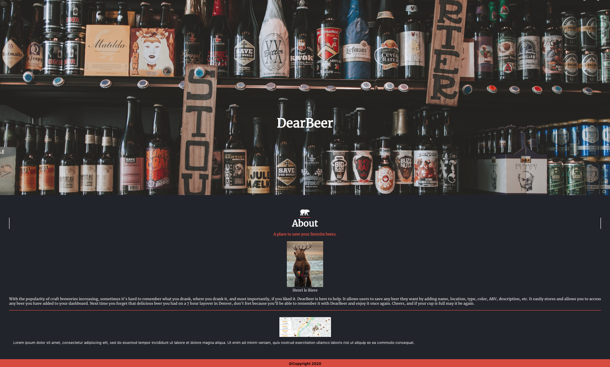
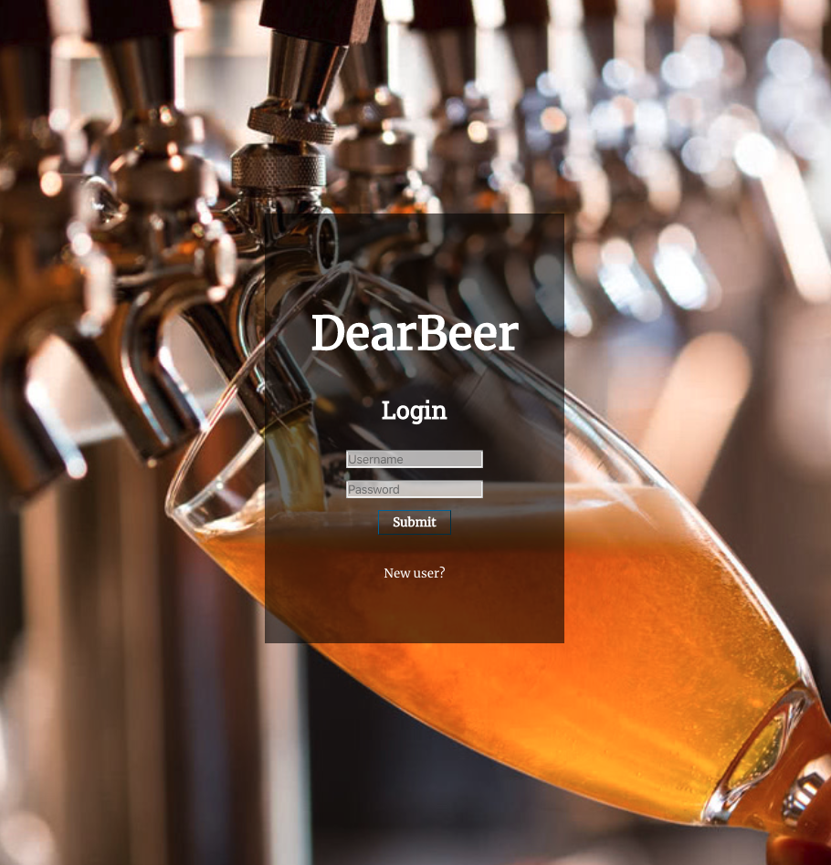
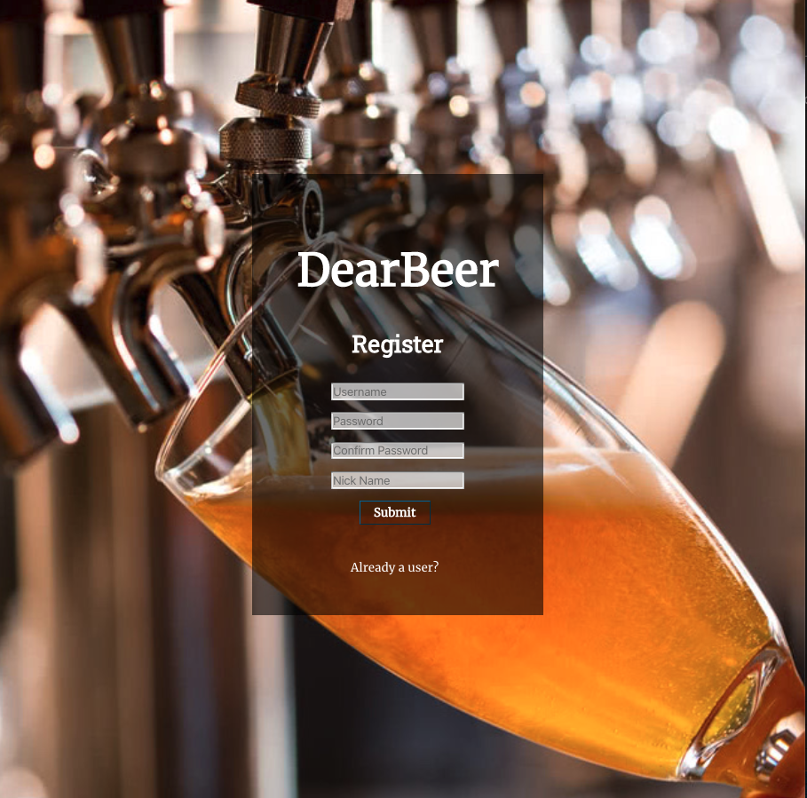
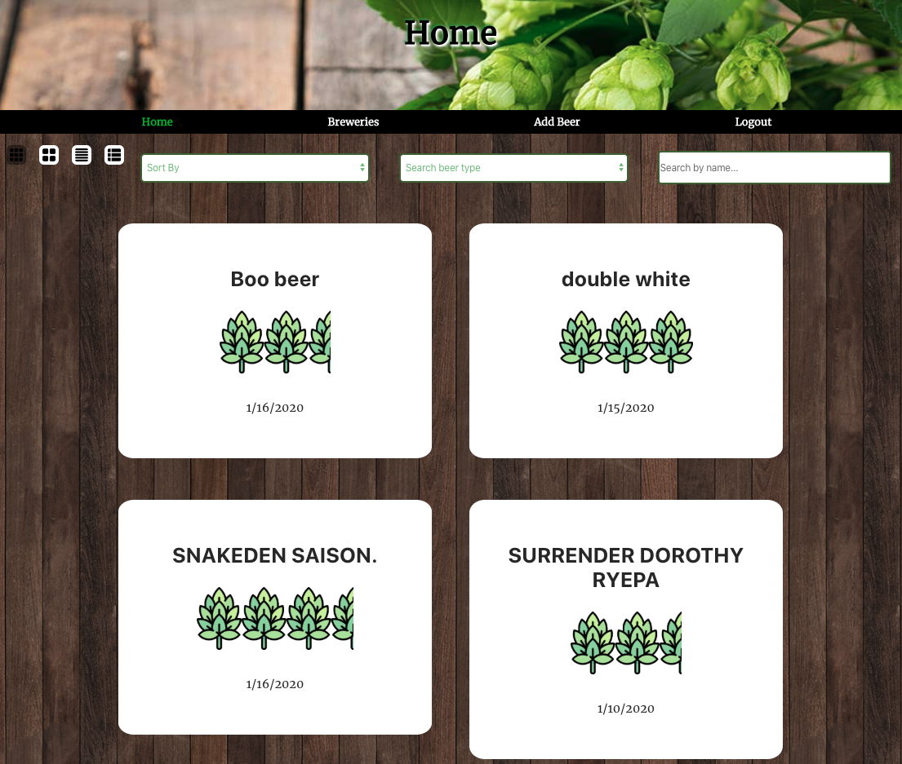
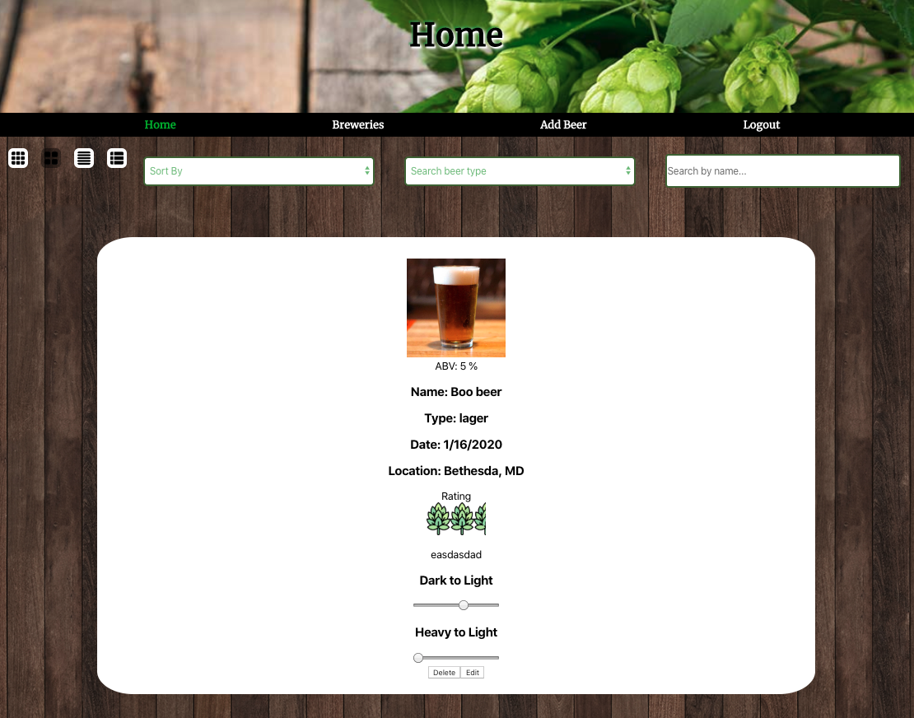
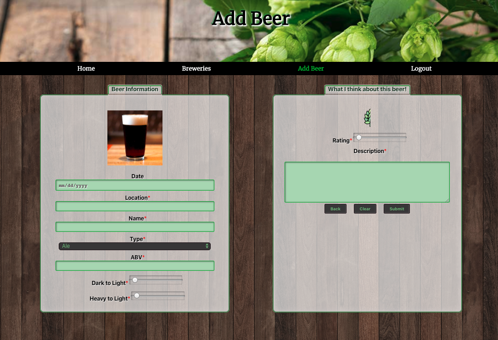
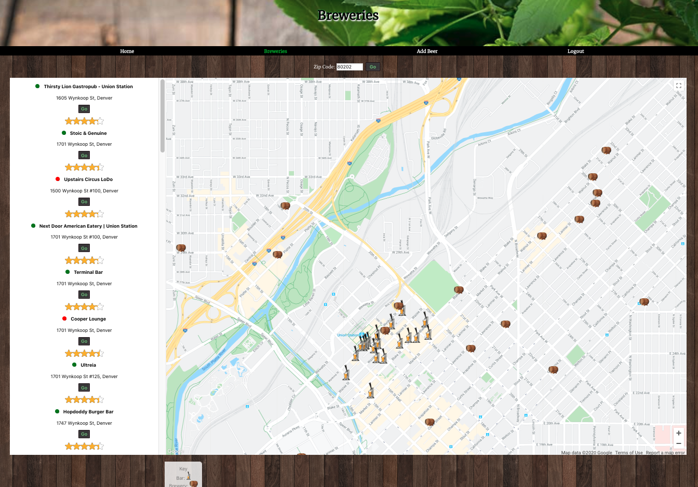

# DearBeer 
[DearBeer.now.sh](https://dearbeer.now.sh)

### Demo
Username: Demo

Password: Test12345!

# Technologies Used

### Client Side:  
React | Javascript | Zeit |  HTML | CSS

### Server Side:
Express.js | Node.js | PostgreSQL | Heroku

# Introduction
DeerBear is a functional user friendly application for avid beer drinkers and aren't afraid to try new beers!   

# Landing Page

# Login Page

# Register Page

# Dashboard
Once the user has started to build their list of beers, the app will provide the user with a detailed dashboard of the generated list of beers.  The user can find beer in beer list by sorting, filtering, and searching for keywords. The dashboard also contains a feature that user can use to costumize and create different list view i.e list, tile, or expanded view.
##### Condensed View

##### Expanded View

# Add Beer Form
The add beer form is displayed with various fields for the user to input information about the beer as well as a rating and description/review of the beer. 

# Breweries Map
It also provides the user with a visual map of exactly where they have tasted all the hoppy goodness. User can search for local bars or breweries and filter.....what else

[Client](https://github.com/thinkful-ei-heron/Group4-Capstone-3.git) |
[Server](https://github.com/thinkful-ei-heron/Group4-Capstone3-API.git)

Getting Started
Installing
Clone the repository and download dependencies.

$ git clone https://github.com/thinkful-ei-heron/Group4-Capstone-3.git
$ cd Group4-Capstone-3
$ npm install
Launching
Start the development server.

$ npm run start

Testing
Run tests
$ npm run test